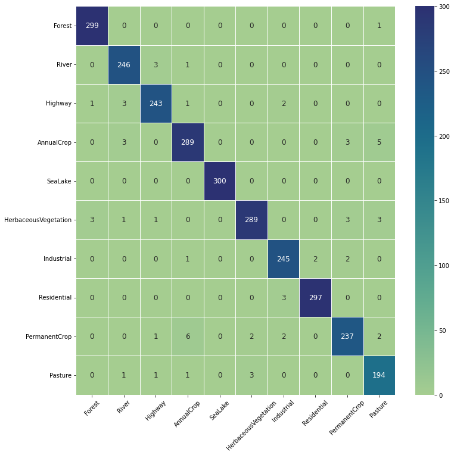
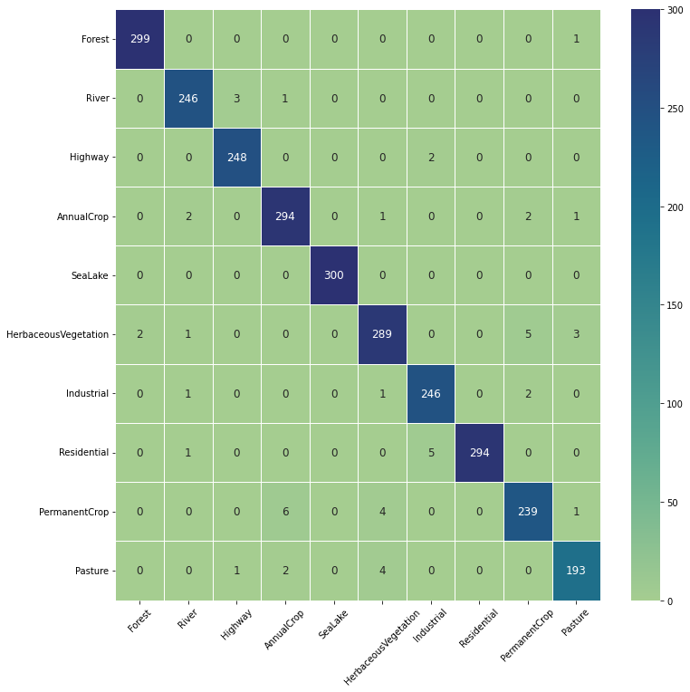
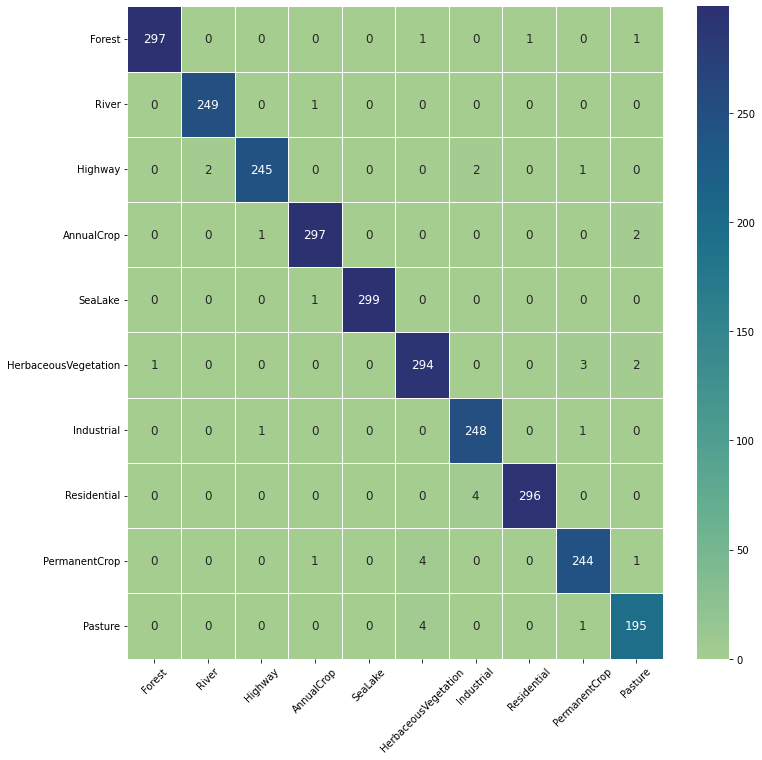

# EuroSat-RGB-Classifiers

This repository contains the performance comparison of three different models fine-tuned on the EuroSAT dataset

## Models Used
1. **ResNet-18** (pre-trained on ImageNet 1k)
2. **ResNet-50** (pre-trained on ImageNet 1k)
3. **ViT-Base-Patch16-224** (pre-trained on ImageNet 21k and fine-tuned on ImageNet 1k)

## Dataset
The dataset comprises JPEG composite chips extracted from Sentinel-2 satellite imagery, representing the Red, Green, and Blue bands. It encompasses 27,000 labeled and geo-referenced images across 10 Land Use and Land Cover (LULC) classes

Splits : Train 80% Validation 10% Test 10% (original dataset's label distribution is consistent in each split)

Link: [Eurosat-RGB Dataset](https://huggingface.co/datasets/cm93/eurosat)

## Models' Performance

Links to final models:
- [resnet18-eurosat](https://huggingface.co/cm93/resnet18-eurosat)
- [resnet50-eurosat](https://huggingface.co/cm93/resnet50-eurosat)
- [vit-base-patch16-224-eurosat](https://huggingface.co/cm93/vit-base-patch16-224-eurosat)

#### Model's loss and accuracy in each phase:

| Model                        | Phase      | Avg Loss | Accuracy  |
|------------------------------|------------|----------|-----------|
| resnet18-eurosat             | Train      | 0.097586 | 97.01%    |
|                              | Validation | 0.071375 | 97.70%    |
|                              | Test       | 0.068443 | 97.74%    |
| resnet50-eurosat             | Train      | 0.076420 | 97.56%    |
|                              | Validation | 0.054377 | 98.30%    |
|                              | Test       | 0.058930 | 98.07%    |
| vit-base-patch16-224-eurosat | Train      | 0.012038 | 99.61%    |
|                              | Validation | 0.023757 | 99.04%    |
|                              | Test       | 0.040557 | 98.67%    |

#### Model's accuracy, precision, recall and F1 score:

| Model                        | Accuracy |  Precision   |    Recall   |     F1      |
|------------------------------|----------|--------------|-------------|-------------|
| resnet18-eurosat             | 97.74%   | 0.97747      | 0.97741     | 0.97740     |
| resnet50-eurosat             | 98.07%   | 0.98078      | 0.98074     | 0.98074     |
| vit-base-patch16-224-eurosat | 98.67%   | 0.98673      | 0.98667     | 0.98668     |

#### Confusion Matrices:
- resnet18-eurosat

- resnet50-eurosat

- vit-base-patch16-224-eurosat

## Usage
For details on the model training procedure and its parameters, please refer to the Jupyter notebooks provided. For a list of required dependencies, refer to requirements.txt.

## Conclusion
- ViT-base-patch16-224 appears to be the best performing model in terms of accuracy, precision, recall, and F1-score, making it a robust choice for the EuroSAT dataset.
- ResNet50 also performs exceptionally well and could be considered if a ResNet architecture is preferred or if there are computational constraints.
- ResNet18, while slightly behind the other two models, still offers strong performance and could be a good choice for scenarios where a smaller, less complex model is desired.
